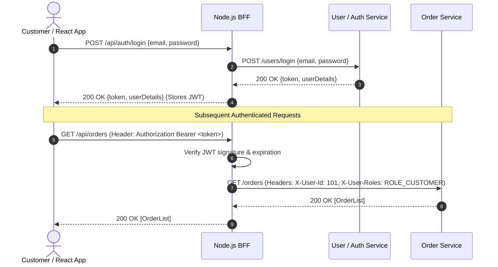
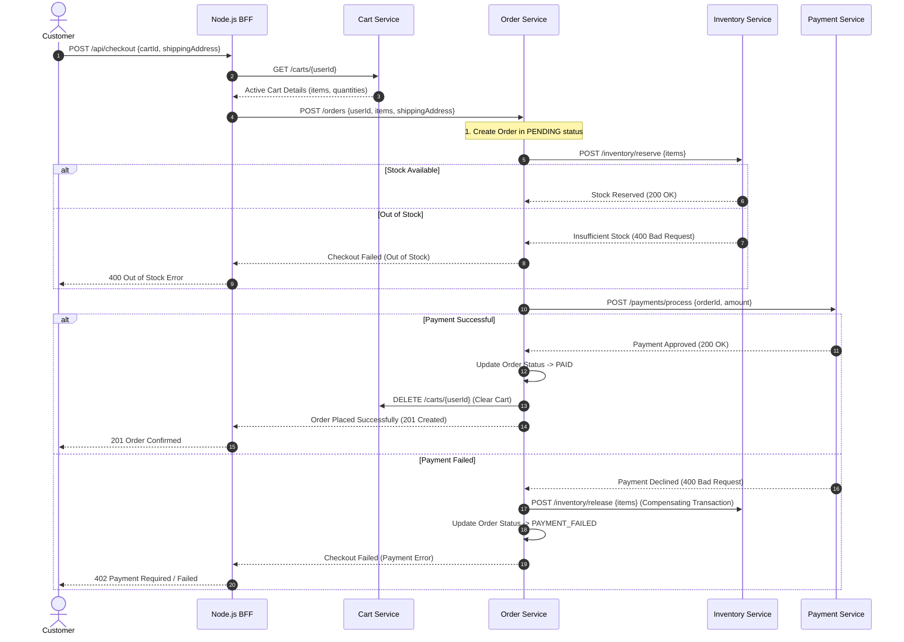

# System Architecture Document — store.io

## 1. System Overview & Architecture Style

`store.io` implements a **Backend-For-Frontend (BFF)** microservices pattern. 

### Key Architectural Principles
* **Loose Coupling & High Cohesion:** Each service manages a single domain bounded context.
* **Database-per-Service:** No microservice shares a database schema with another.
* **Stateless Authentication:** User identity is verified via JWTs issued by `user-service` and verified at the BFF / microservice boundary.
* **BFF Aggregation:** The Node.js BFF shields the React frontend from microservice complexity, handling request orchestration, data aggregation, and API protocol translation.

---

## 2. High-Level System Topology

```mermaid
flowchart TD
    subgraph Client Tier
        Client["React Single-Page Application (SPA)"]
    end

    subgraph API Gateway / BFF Tier
        BFF["Node.js / Express BFF"]
    end

    subgraph Backend Microservices Tier
        USR["User / Auth Service (8081)"]
        PRD["Product Catalog Service (8082)"]
        INV["Inventory Service (8083)"]
        CRT["Cart Service (8084)"]
        ORD["Order Service (8085)"]
        PAY["Payment Service (8086)"]
    end

    subgraph Persistence Tier
        DB_USR[("user_db (MySQL)")]
        DB_PRD[("product_db (MySQL)")]
        DB_INV[("inventory_db (MySQL)")]
        DB_CRT[("cart_db (MySQL)")]
        DB_ORD[("order_db (MySQL)")]
        DB_PAY[("payment_db (MySQL)")]
    end

    Client -->|HTTP / REST (JSON)| BFF

    BFF -->|REST / JWT Validation| USR
    BFF -->|REST| PRD
    BFF -->|REST| INV
    BFF -->|REST| CRT
    BFF -->|REST| ORD
    BFF -->|REST| PAY

    USR --- DB_USR
    PRD --- DB_PRD
    INV --- DB_INV
    CRT --- DB_CRT
    ORD --- DB_ORD
    PAY --- DB_PAY
```

---

## 3. Security & Authentication Architecture

### 3.1 Token Lifecycle & Propagation
Authentication is stateless and uses Signed JSON Web Tokens (JWT).



### 3.2 Security Responsibilities
1. **User/Auth Service:** Owns user credentials, password hashing (BCrypt), and JWT generation using a secret key (`jwt.secret`).
2. **Node.js BFF Layer:** Intercepts client requests, validates JWT signature/expiration, extracts user claims (`userId`, `roles`), and forwards enriched internal request headers (`X-User-Id`, `X-User-Roles`).
3. **Internal Microservices:** Rely on trusted headers (`X-User-Id`, `X-User-Roles`) passed from BFF for authorization rules.

---

## 4. Checkout Transaction Orchestration (Saga Sequence)

The checkout process spans multiple independent microservices. We use an **Orchestrated Saga Pattern** where `Order Service` acts as the coordinator.



---

## 5. API Design & Communication Standards

### 5.1 Communication Protocol
* All inter-service communication utilizes **HTTP/1.1 REST** with JSON payloads.
* Synchronous HTTP calls are kept to a minimum during read operations (BFF aggregates read endpoints concurrently using `Promise.all`).

### 5.2 Error Handling Standard (RFC 7807)
All microservices return standard error payloads adhering to **RFC 7807 Problem Details**:

```json
{
  "type": "https://store.io/errors/insufficient-inventory",
  "title": "Insufficient Stock",
  "status": 400,
  "detail": "Product ID 402 only has 2 items available, but 5 were requested.",
  "instance": "/inventory/reserve",
  "timestamp": "2026-10-01T12:55:00Z"
}
```

---

## 6. Resilience & Fault Tolerance Strategy

| Failure Scenario | Impact | Mitigation Strategy |
|---|---|---|
| **Inventory Service Unreachable** | Cannot process new checkouts | Circuit Breaker (Fail fast), product catalog stays operational. |
| **Payment Gateway Downtime** | Payment failure during checkout | Compensating transaction automatically releases reserved inventory stock. |
| **Database Network Blip** | Intermittent SQL errors | HikariCP connection pool with retry mechanism. |
| **BFF Traffic Spike** | High CPU/Memory usage | Node.js asynchronous event loop; scale BFF instances horizontally. |
