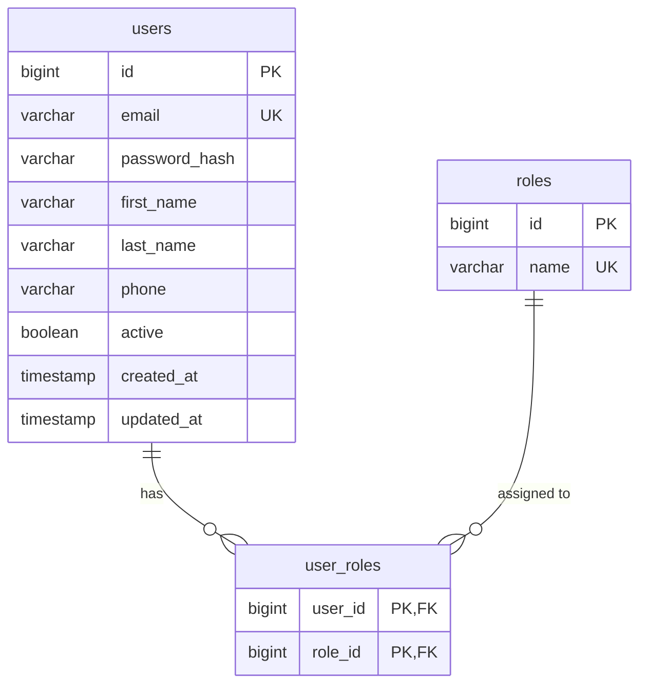
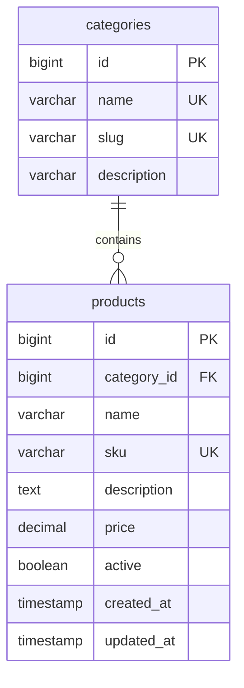
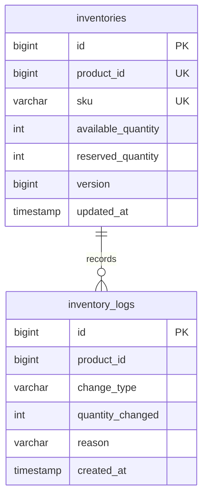
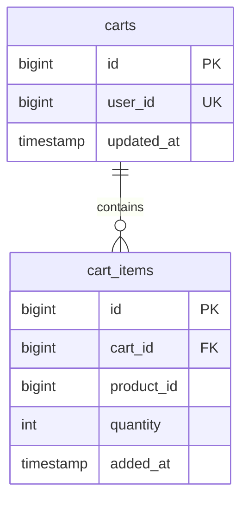
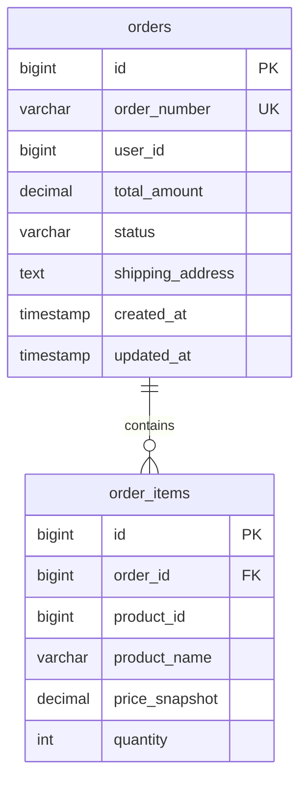
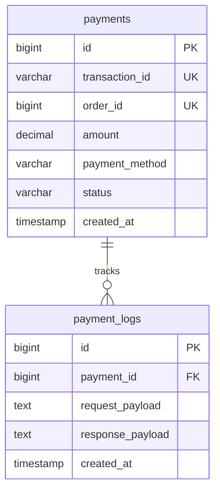

# Database Design Specification — store.io

## 1. Overview & Database-per-Service Strategy

In `store.io`, each microservice strictly owns its own MySQL database instance/schema. No direct cross-database queries or foreign keys between microservice databases are allowed. Domain entity references across boundaries use logical IDs (e.g., `user_id`, `product_id`).

### Summary of Databases & Tables
```text
1. user_db       --> users, roles, user_roles
2. product_db    --> categories, products
3. inventory_db  --> inventories, inventory_logs
4. cart_db       --> carts, cart_items
5. order_db      --> orders, order_items
6. payment_db    --> payments, payment_logs
```

---

## 2. Service Database Schemas

### 2.1 User Service Database (`user_db`)

#### ER Diagram


#### Data Tables Specification

##### Table: `users`
| Column | Type | Constraints | Description |
|---|---|---|---|
| `id` | `BIGINT` | `PRIMARY KEY`, `AUTO_INCREMENT` | Unique User ID |
| `email` | `VARCHAR(150)` | `NOT NULL`, `UNIQUE` | User login email |
| `password_hash` | `VARCHAR(255)` | `NOT NULL` | BCrypt encrypted password hash |
| `first_name` | `VARCHAR(100)` | `NOT NULL` | First name |
| `last_name` | `VARCHAR(100)` | `NOT NULL` | Last name |
| `phone` | `VARCHAR(20)` | `NULL` | Phone number |
| `active` | `BOOLEAN` | `DEFAULT TRUE` | Account status flag |
| `created_at` | `TIMESTAMP` | `DEFAULT CURRENT_TIMESTAMP` | Audit timestamp |
| `updated_at` | `TIMESTAMP` | `DEFAULT CURRENT_TIMESTAMP ON UPDATE CURRENT_TIMESTAMP` | Audit timestamp |

##### Table: `roles`
| Column | Type | Constraints | Description |
|---|---|---|---|
| `id` | `BIGINT` | `PRIMARY KEY`, `AUTO_INCREMENT` | Role ID |
| `name` | `VARCHAR(50)` | `NOT NULL`, `UNIQUE` | Role name (`ROLE_CUSTOMER`, `ROLE_ADMIN`) |

##### Table: `user_roles`
| Column | Type | Constraints | Description |
|---|---|---|---|
| `user_id` | `BIGINT` | `FK -> users(id) ON DELETE CASCADE` | User reference |
| `role_id` | `BIGINT` | `FK -> roles(id) ON DELETE CASCADE` | Role reference |

---

### 2.2 Product Service Database (`product_db`)

#### ER Diagram


#### Data Tables Specification

##### Table: `categories`
| Column | Type | Constraints | Description |
|---|---|---|---|
| `id` | `BIGINT` | `PRIMARY KEY`, `AUTO_INCREMENT` | Category ID |
| `name` | `VARCHAR(100)` | `NOT NULL`, `UNIQUE` | Category display name |
| `slug` | `VARCHAR(100)` | `NOT NULL`, `UNIQUE` | URL-friendly slug |
| `description` | `VARCHAR(255)` | `NULL` | Category description |

##### Table: `products`
| Column | Type | Constraints | Description |
|---|---|---|---|
| `id` | `BIGINT` | `PRIMARY KEY`, `AUTO_INCREMENT` | Product ID |
| `category_id` | `BIGINT` | `NOT NULL`, `FK -> categories(id)` | Logical category reference |
| `name` | `VARCHAR(200)` | `NOT NULL` | Product name |
| `sku` | `VARCHAR(100)` | `NOT NULL`, `UNIQUE` | Stock Keeping Unit identifier |
| `description` | `TEXT` | `NULL` | Detailed description |
| `price` | `DECIMAL(10,2)` | `NOT NULL`, `CHECK (price >= 0)` | Unit price in USD |
| `active` | `BOOLEAN` | `DEFAULT TRUE` | Soft delete / catalog visibility flag |
| `created_at` | `TIMESTAMP` | `DEFAULT CURRENT_TIMESTAMP` | Audit timestamp |
| `updated_at` | `TIMESTAMP` | `DEFAULT CURRENT_TIMESTAMP ON UPDATE CURRENT_TIMESTAMP` | Audit timestamp |

---

### 2.3 Inventory Service Database (`inventory_db`)

#### ER Diagram


#### Data Tables Specification

##### Table: `inventories`
| Column | Type | Constraints | Description |
|---|---|---|---|
| `id` | `BIGINT` | `PRIMARY KEY`, `AUTO_INCREMENT` | Inventory ID |
| `product_id` | `BIGINT` | `NOT NULL`, `UNIQUE` | Logical reference to `product_db.products(id)` |
| `sku` | `VARCHAR(100)` | `NOT NULL`, `UNIQUE` | Product SKU |
| `available_quantity` | `INT` | `NOT NULL`, `CHECK (available_quantity >= 0)` | Unreserved stock count |
| `reserved_quantity` | `INT` | `NOT NULL DEFAULT 0`, `CHECK (reserved_quantity >= 0)` | Stock held during pending checkouts |
| `version` | `BIGINT` | `NOT NULL DEFAULT 0` | Optimistic locking version field |
| `updated_at` | `TIMESTAMP` | `DEFAULT CURRENT_TIMESTAMP ON UPDATE CURRENT_TIMESTAMP` | Audit timestamp |

##### Table: `inventory_logs`
| Column | Type | Constraints | Description |
|---|---|---|---|
| `id` | `BIGINT` | `PRIMARY KEY`, `AUTO_INCREMENT` | Log ID |
| `product_id` | `BIGINT` | `NOT NULL` | Product reference |
| `change_type` | `ENUM` | `'RESTOCK', 'RESERVE', 'RELEASE', 'DEDUCT'` | Operation type |
| `quantity_changed` | `INT` | `NOT NULL` | Quantity delta |
| `reason` | `VARCHAR(255)` | `NULL` | Transaction description / Order reference |
| `created_at` | `TIMESTAMP` | `DEFAULT CURRENT_TIMESTAMP` | Log timestamp |

---

### 2.4 Cart Service Database (`cart_db`)

#### ER Diagram


#### Data Tables Specification

##### Table: `carts`
| Column | Type | Constraints | Description |
|---|---|---|---|
| `id` | `BIGINT` | `PRIMARY KEY`, `AUTO_INCREMENT` | Cart ID |
| `user_id` | `BIGINT` | `NOT NULL`, `UNIQUE` | Owner user reference |
| `updated_at` | `TIMESTAMP` | `DEFAULT CURRENT_TIMESTAMP ON UPDATE CURRENT_TIMESTAMP` | Audit timestamp |

##### Table: `cart_items`
| Column | Type | Constraints | Description |
|---|---|---|---|
| `id` | `BIGINT` | `PRIMARY KEY`, `AUTO_INCREMENT` | Cart Item ID |
| `cart_id` | `BIGINT` | `NOT NULL`, `FK -> carts(id) ON DELETE CASCADE` | Parent cart reference |
| `product_id` | `BIGINT` | `NOT NULL` | Logical product reference |
| `quantity` | `INT` | `NOT NULL`, `CHECK (quantity > 0)` | Selected item count |
| `added_at` | `TIMESTAMP` | `DEFAULT CURRENT_TIMESTAMP` | Creation timestamp |

---

### 2.5 Order Service Database (`order_db`)

#### ER Diagram


#### Data Tables Specification

##### Table: `orders`
| Column | Type | Constraints | Description |
|---|---|---|---|
| `id` | `BIGINT` | `PRIMARY KEY`, `AUTO_INCREMENT` | Internal Order ID |
| `order_number` | `VARCHAR(50)` | `NOT NULL`, `UNIQUE` | Business Order Reference (e.g. `ORD-20261001-9481`) |
| `user_id` | `BIGINT` | `NOT NULL` | Customer ID |
| `total_amount` | `DECIMAL(10,2)` | `NOT NULL`, `CHECK (total_amount >= 0)` | Calculated total order amount |
| `status` | `ENUM` | `'PENDING', 'PAID', 'PAYMENT_FAILED', 'SHIPPED', 'CANCELLED'` | State machine status |
| `shipping_address` | `TEXT` | `NOT NULL` | Shipping address JSON / plain text |
| `created_at` | `TIMESTAMP` | `DEFAULT CURRENT_TIMESTAMP` | Order timestamp |
| `updated_at` | `TIMESTAMP` | `DEFAULT CURRENT_TIMESTAMP ON UPDATE CURRENT_TIMESTAMP` | State update timestamp |

##### Table: `order_items`
| Column | Type | Constraints | Description |
|---|---|---|---|
| `id` | `BIGINT` | `PRIMARY KEY`, `AUTO_INCREMENT` | Order Item ID |
| `order_id` | `BIGINT` | `NOT NULL`, `FK -> orders(id) ON DELETE CASCADE` | Parent order reference |
| `product_id` | `BIGINT` | `NOT NULL` | Product ID reference |
| `product_name` | `VARCHAR(200)` | `NOT NULL` | Snapshot product title |
| `price_snapshot` | `DECIMAL(10,2)` | `NOT NULL`, `CHECK (price_snapshot >= 0)` | **Price snapshot at time of checkout** |
| `quantity` | `INT` | `NOT NULL`, `CHECK (quantity > 0)` | Quantity purchased |

---

### 2.6 Payment Service Database (`payment_db`)

#### ER Diagram


#### Data Tables Specification

##### Table: `payments`
| Column | Type | Constraints | Description |
|---|---|---|---|
| `id` | `BIGINT` | `PRIMARY KEY`, `AUTO_INCREMENT` | Payment Record ID |
| `transaction_id` | `VARCHAR(100)` | `NOT NULL`, `UNIQUE` | External Gateway Transaction ID |
| `order_id` | `BIGINT` | `NOT NULL`, `UNIQUE` | Associated Order ID |
| `amount` | `DECIMAL(10,2)` | `NOT NULL`, `CHECK (amount >= 0)` | Total paid amount |
| `payment_method` | `VARCHAR(50)` | `NOT NULL` | Payment channel (`CREDIT_CARD`, `MOCK_GATEWAY`) |
| `status` | `ENUM` | `'SUCCESS', 'FAILED', 'REFUNDED'` | Gateway transaction result |
| `created_at` | `TIMESTAMP` | `DEFAULT CURRENT_TIMESTAMP` | Transaction timestamp |

##### Table: `payment_logs`
| Column | Type | Constraints | Description |
|---|---|---|---|
| `id` | `BIGINT` | `PRIMARY KEY`, `AUTO_INCREMENT` | Log ID |
| `payment_id` | `BIGINT` | `NOT NULL`, `FK -> payments(id)` | Parent payment reference |
| `request_payload` | `TEXT` | `NULL` | Outgoing gateway request body |
| `response_payload` | `TEXT` | `NULL` | Incoming gateway response body |
| `created_at` | `TIMESTAMP` | `DEFAULT CURRENT_TIMESTAMP` | Audit log timestamp |

---

## 3. Database Indexing Strategy

High-frequency query lookup indexes configured across tables:

| Database | Table | Index Name | Column(s) | Reason |
|---|---|---|---|---|
| `user_db` | `users` | `idx_users_email` | `email` | Fast user login lookup |
| `product_db` | `products` | `idx_products_category` | `category_id` | Category filtering queries |
| `product_db` | `products` | `idx_products_sku` | `sku` | SKU resolution queries |
| `inventory_db` | `inventories` | `idx_inventory_product` | `product_id` | Instant inventory balance lookup |
| `cart_db` | `cart_items` | `idx_cart_items_cart` | `cart_id` | Bulk fetching user cart items |
| `order_db` | `orders` | `idx_orders_user` | `user_id` | Fetching user order history |
| `order_db` | `orders` | `idx_orders_status` | `status` | Admin status queries & saga pollers |
| `payment_db` | `payments` | `idx_payments_order` | `order_id` | Verifying order payment status |
